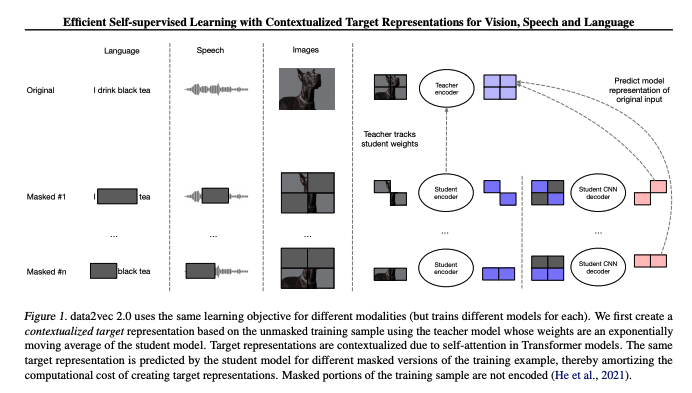

Implementation of FAIR's Data2Vec2.0 for vision. ([Efficient Self-supervised Learning with Contextualized Target Representations
for Vision, Speech and Language](https://paperswithcode.com/paper/efficient-self-supervised-learning-with)

Uses @lucidrains x-transfromers (https://github.com/lucidrains/x-transformers)

Basic Schematic of Architecture:

In order to run, just run: `python train.py` on your command line

TODO:
- implement inverse block masking
